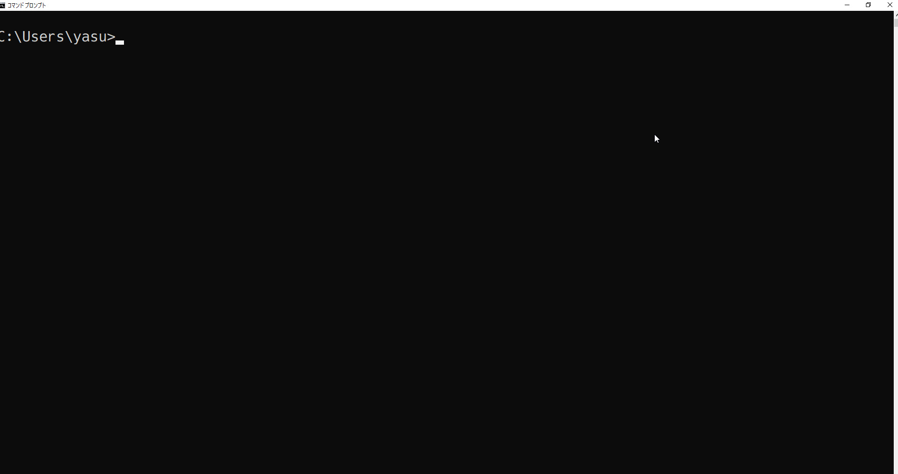
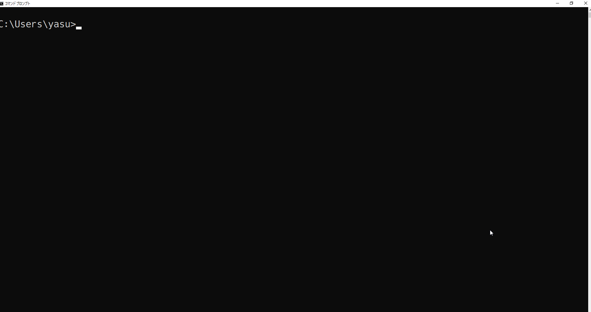
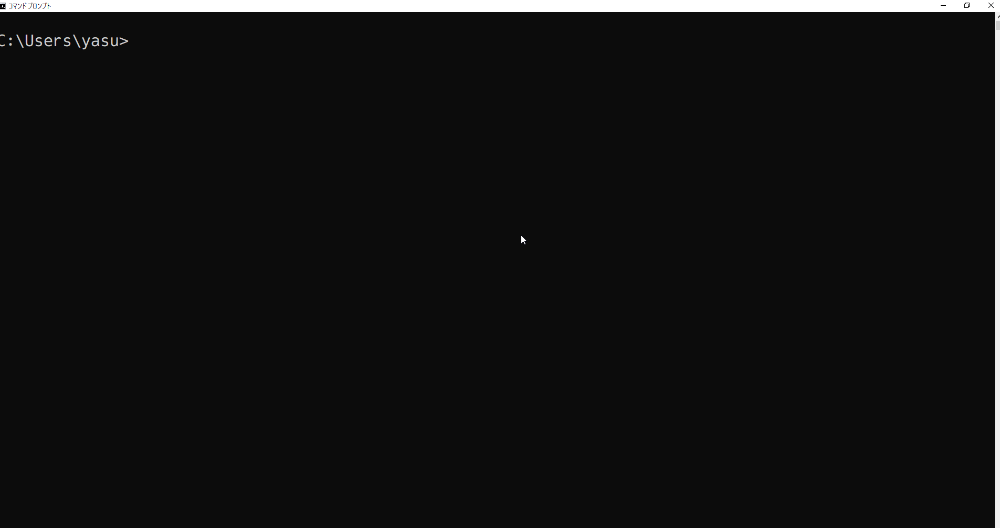
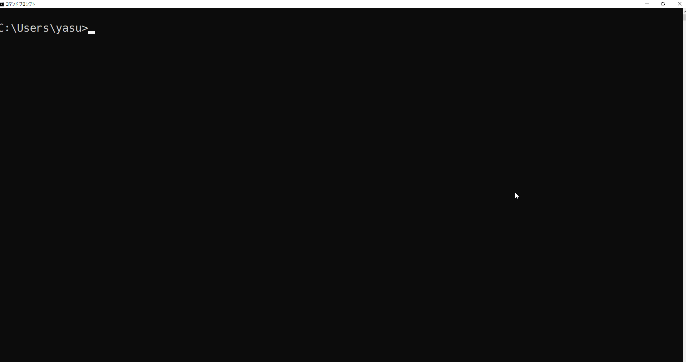
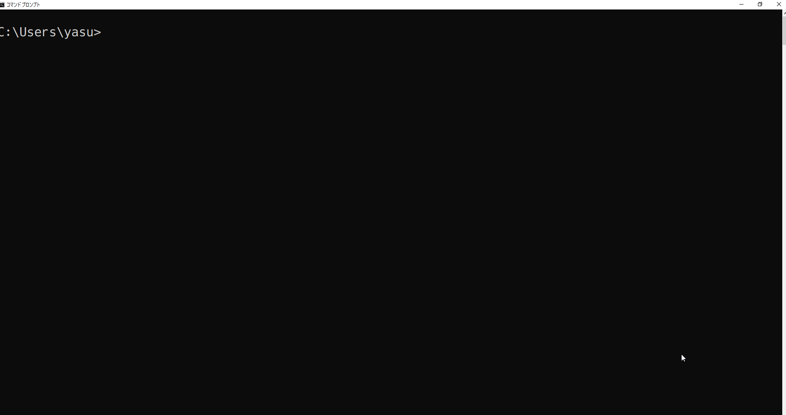

# gonono

gonono is an accessor tool to your note directory

## How to install

### with golang

If you have installed golang. You can install with `go get` command.

```cmd
$ go get github.com/yasukotelin/gonono
```

### for windows users

If you use Windows, you can download the built binary from [release page](https://github.com/yasukotelin/gonono/releases/tag/v1.0.0).

## What is the Note direcotry?

If you want to write the note with your favorite editor, may be you have created the directory on local for markdown files.

This app is assuming that directory was created like the following.

```
note
├─food
│  └─2018-12-12-in-tokyo
│          index.md
│          picture1.jpeg
│          picture2.jpeg
│
├─game
│  ├─cod
│  │  └─2019-03-12-hint
│  │          index.md
│  │
│  └─ff
│      ├─2019-01-01-monster-data
│      │      index.md
│      │
│      └─2019-01-02-item-data
│              index.md
│
└─memo
    ├─2019-05-20-memo1
    │      index.md
    │
    └─2019-05-20-memo2
            index.md
```

## Setting

If you puts the `.gonono.json` on the `~` (home directory) or run `gonono init` , gonono reads it.

```json
{
    "path": "~/Dropbox/note",
    "editor": "gvim"
}
```

| key    | value                    | example        |
|--------|--------------------------|----------------|
| path   | your note directory path | ~/Dropbox/note |
| editor | your favorite editor     | gvim           |

> **NOTE**  windows path -> `C:\\Users\\yourname`

## Commands

| Command | Sub command |                                           |
|---------|-------------|-------------------------------------------|
| gonono  |             | opens the note directory with your editor |
| gonono  | init, i     | creates the empty config file             |
| gonono  | open, o     | opens the note directory with explorer    |
| gonono  | new, n      | creates the new note                      |
| gonono  | finder, f   | find the created note with fzf            |

### gonono

You can access to the note directory very easily by executing `gonono` command.

with GVim❤



with Visual Studio Code🎉




### gonono init

If you use `gonono init` command, the empty config json file is created  on the home directory.



### gonono open

Open with explorer.



### gonono new

| Command    | Flag       |                     |
|------------|------------|---------------------|
| gonono new | --dir, -d  | create to the dir   |
| gonono new | --open, -o | opens after created |

If you run `gonoon new` command, gonono asks you Title.



```cmd
$ gonono new
Title: sample note
```

`yyyy-MM-dd-sample-note\inde.md` is created on the root of note directory.

- Creates new directory and `index.md` by your inputed the title.
- Date is added to the directory name.
- Spaces of your inputed title is replaced by hyphen `-`.

> **NOTE** The created new note by `new` command is put on the root of the note direcotry.

if you want to specify the direcotry, you can use the `-dir` `-d` flag.


```cmd
$ gonono new -d develop/gonono
Title: How to use the gonono
```

`develop/gonono/yyyy-MM-dd-How-to-use-the-gonono\inde.md` is created on the root of note directory.

> **NOTE** You have to specify the **relative path** from the root of the note directory.

If you specify the `--open` or `-o`, open the created it.

### gonono finder

If you have installed [fzf](https://github.com/junegunn/fzf), you can find a created note fuzzily with fzf.


